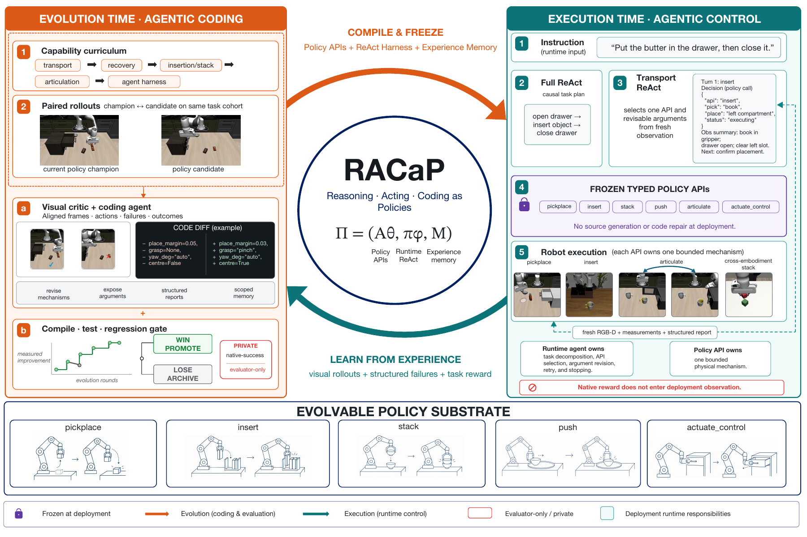
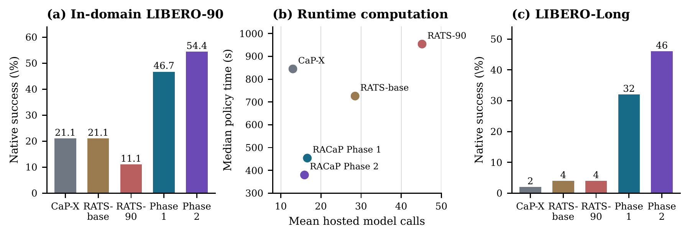
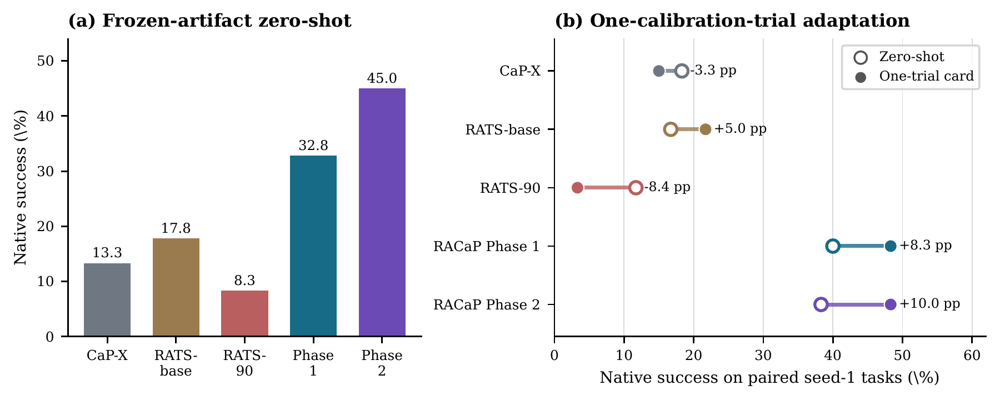

<h1 align="center">RACaP</h1>

<p align="center"><strong>Agentic Reasoning, Acting, and Coding as Policies for Evolvable Robot Learning</strong></p>

<p align="center"><a href="README.md">English</a> · <a href="docs/REPRODUCIBILITY.md">复现指南</a> · <a href="LICENSE">MIT License</a></p>

RACaP 关注一个核心问题：哪些能力应该沉淀成可复用代码，哪些选择应该留给机器人在
运行时根据现场情况决定。传统 Code as Policy 方法常在任务到来后生成或修复代码，灵活
但慢，而且容易把一次失败写成只适用于某个场景的坐标补丁。RACaP 把写代码和改代码移到
部署前的进化阶段。实际执行时，视觉 ReAct agent 只调用类型明确、参数可调的 Policy API，
并根据新图像修改下一次调用。

这是 RACaP 源码包。它包含完整 runtime、论文中的 Phase 1 与 Phase 2 冻结策略、
进化 harness、评测脚本和测试。历史 rollout、视频、缓存、账号凭据、
模型权重和下载得到的大型仿真仓库均未打包。

## 系统由什么组成



RACaP 的策略写成 \(\Pi=(\mathcal A_\theta,\pi_\phi,\mathcal M)\)：

- \(\mathcal A_\theta\) 是六个通用 Policy API，负责感知、几何、运动、接触和恢复机制。
- \(\pi_\phi\) 是 runtime ReAct agent。Full ReAct 负责完整任务的拆分、因果顺序和工具路由，
  Transport ReAct 负责一次物体搬运中的观察、动作、检查和局部恢复。
- \(\mathcal M\) 是经验记忆。它提供视觉辨别、工具路由和失败恢复建议，但当前视觉证据和
  ReAct 判断拥有最终决策权。

Policy API 不是写死的轨迹，也不是过于简单的一步 primitive。它们固化可以跨任务复用的
物理机制，同时暴露抓取方式、目标区域、角度、边界、误差、接触策略和运动幅度等接口，
让 ReAct 能够在不写新代码的情况下适应当前场景。

## 两阶段进化

**Phase 1：能力课程学习。** 系统依次建立 execution、recovery、breadth 和 orchestration。
具体包括直接搬运与几何、视觉闭环和有界重试、`pickplace`、`insert`、`stack`、`push`、
`articulate`、`actuate_control` 六个 API，以及长程任务的 Full ReAct 编排。过弱的初始系统
很难产生可归因的失败，因此 Phase 1 先建立可执行、可诊断的基础能力。冻结代码位于
[`policies/phase1`](policies/phase1/)。

**Phase 2：自主 self-evolution。** 系统从 Phase 1 出发，自动聚类失败，让视觉 critic 找到
最早的行为偏差，再由 coding agent 提出通用修改。父策略和候选策略在完全相同的任务、seed
和预算上成对评测，只有 native success 严格增加才晋级。冻结代码位于
[`policies/phase2`](policies/phase2/)。

## 论文主要结果



Phase 2 在 LIBERO-90 上的准确率为 **54.4%**，在 LIBERO-Long 上为 **46.0%**。
图中 Phase 1 是完整记录的重放成绩；论文另行记录了 rollout 随机性带来的差异。



冻结 Phase 2 在 LIBERO-PRO 上达到 **45.0%**。右图是独立的校准适应实验，
不计入零样本成绩。CaP-X 和 RATS 为本研究统一设置下的对照，不是其原论文设置的复现。

完整数据见 [`experiments/paper_results.csv`](experiments/paper_results.csv) 和
[`experiments/libero_pro_breakdown.csv`](experiments/libero_pro_breakdown.csv)，评测口径与来源见
[`experiments/PROVENANCE.md`](experiments/PROVENANCE.md)。

## 目录

```text
racap/                    固定 runtime、ReAct、六个通用 Policy API 与 backend
policies/phase1/          Phase 1 冻结 controller、wrapper 和 memory
policies/phase2/          Phase 2 冻结 controller、wrapper 和 memory
evolution/harness/        调度、critic、coder、隔离 Git、成对选择和回退
evolution/prompts/        进化约束与各 curriculum stage 的提示
experiments/              论文对比实验与轻量 ReAct 训练代码
scripts/                  安装、服务启动、评测和环境检查
tests/                    单元测试与接口测试
third_party/rats/         共享 backend 使用的固定上游源码
```

## 安装与运行

```bash
git clone https://github.com/Robo-Harness/racap.git
cd racap
bash scripts/bootstrap.sh
cp configs/local.env.example configs/local.env
chmod 600 configs/local.env
# 填写模型路由后：
source configs/env.sh
bash scripts/start_services.sh
bash scripts/doctor.sh
```

只跑一条 Phase 2 并录制视频和可读轨迹：

```bash
bash scripts/evaluate.sh phase2 smoke_t071 --task-ids 71 --seeds 0 --workers 1
```

全量评测两阶段：

```bash
bash scripts/evaluate.sh phase1 phase1_full90 --seeds 0
bash scripts/evaluate.sh phase2 phase2_full90 --seeds 0
```

结果会生成在 `outputs/full_agent_eval/<tag>/`。从 Phase 1 启动一个隔离的进化实验：

```bash
racap-evolve run --experiment example_phase2_run \
  --stage auto --runtime-candidates 2 --workers 2
```

不下载仿真器也可以先检查纯 Python 源码：

```bash
python -m pip install -e ".[dev]"
python -m compileall -q racap evolution policies experiments scripts tests
PYTHONPATH="$PWD" python -m pytest -q
```

未安装外部 LIBERO 仿真器时，对应集成测试会跳过。两个阶段的独立测试分别使用
`policies/phase1` 和 `policies/phase2` 作为 solution 包根目录，命令见英文说明。

更完整的安装、外部依赖、评测公平性和结果边界见 [`docs`](docs/)。

## 外部资产与凭据

API key 只填写在被忽略的 `configs/local.env` 中。兼容模型服务需要显式设置
`RACAP_VAPI_BASE`，代码不默认选择第三方中转地址。
仿真初始状态、生成的基线技能库等数据不随源码发布。使用
`python scripts/prepare_assets.py --source /path/to/authorized-assets`
从有权使用的本地资产目录准备数据，完整说明见复现文档。
发布源码前执行 `python scripts/check_release.py --tracked`，并检查提交导出的干净源码。
进化会执行模型生成的代码，Git 工作树并非安全沙箱；请参照[安全说明](SECURITY.md)
在最小权限的隔离环境中运行。

## 许可证

RACaP 自有代码采用 [MIT](LICENSE)，第三方代码保留各自许可证，见
[第三方声明](THIRD_PARTY_NOTICES.md)。
